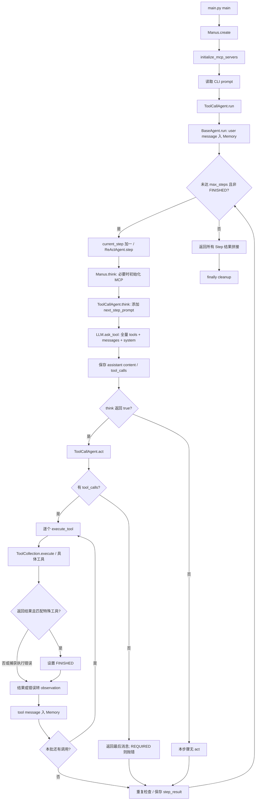
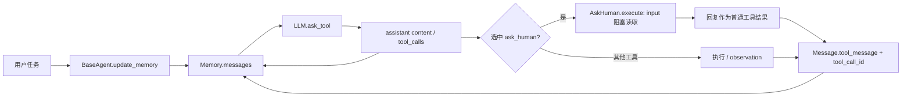
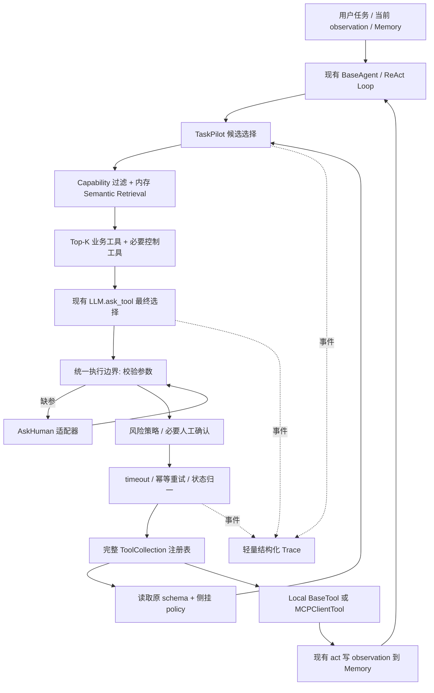

# TaskPilot Phase 0 — OpenManus Repository Analysis

## 分析基线与证据边界

- 分析日期：2026-09-27。
- 上游：`FoundationAgents/OpenManus`，默认分支 `main`，固定 commit：[`3309bf4e416fb1c74b008f3e86494439a31bad53`](https://github.com/FoundationAgents/OpenManus/commit/3309bf4e416fb1c74b008f3e86494439a31bad53)。以下结论仅适用于该快照。
- 源码实际读取位置：`/home/abc/.cache/taskpilot-analysis/OpenManus-3309bf4`。文中 `app/...` 等路径均相对于这个上游源码根目录；引用链接固定 commit，不指向会变动的 `main`。
- TaskPilot 工作区 `/home/abc/文档/ChatGPT/TaskPilot` 初始只有未跟踪的 `AGENTS.md`，Git 尚无提交，没有 OpenManus 产品代码。用户随后提供上游地址，因此本报告分析获取的上游快照，**不声称源码已经导入 TaskPilot 工作区**。
- 已完整读取根目录 `AGENTS.md`。`docs/TASKPILOT_CONTEXT.md` 不存在，无法读取；本轮按 `AGENTS.md` 的产品定位、Scope、工程原则和用户最新的分析任务执行。不覆盖或重写约束文件。
- 方法：阅读源码、跨文件调用追踪、关键词检索和 Python AST symbol/行号核验。没有安装依赖、启动 Agent、调用模型、启动 MCP 服务或运行 Benchmark。运行时推断与待验证项明确标注；没有性能提升数字。
- 本轮仅交付本文档；后文的架构、修改点和 PR 均为建议，未实现。

## Architecture Summary

### 产品约束

TaskPilot 是基于 OpenManus 的单 Agent Developer Agent，Hero Use Case 为 Repository Issue Investigation。MVP 覆盖 Repository Understanding、Issue Investigation、Code Investigation、Technical Research 和 Controlled Developer Actions。保留动态 Agent Loop，不能把 intent 硬编码为固定工具调用序列。优先复用、wrapper、adapter 和 composition；初期 10～20 个工具用内存检索，Top-K=3 仅是待评估起点。不引入多 Agent 平台、外部向量数据库、Redis、工作流引擎或大型可观测性平台。副作用执行必须经过参数校验、风险检查和人工确认，真实业务集成不能由 mock 替代，Benchmark 指标不得伪造。

### 真实模块边界

| 层次 | 真实文件 / symbol | 当前职责 |
| --- | --- | --- |
| CLI 入口 | `main.py::main` [S01] | `Manus.create()`、读取一次 prompt、调用 `run()`、cleanup |
| Agent 生命周期 | `app/agent/base.py::BaseAgent.run/state_context` [S02] | 内存写入、状态、步数循环、重复内容检查 |
| 决策/执行步骤 | `app/agent/react.py::ReActAgent.step` [S03] | `think()` 后依据布尔值调用 `act()` |
| Function calling | `app/agent/toolcall.py::ToolCallAgent` [S04] | 全量工具 schema 请求、处理模型 tool_calls、串行执行并记录 observation |
| 默认 Agent 装配 | `app/agent/manus.py::Manus` [S05] | 4 个默认 Local Tool，加自动/配置的 MCP 工具 |
| 工具接口/注册表 | `app/tool/base.py::BaseTool/ToolResult`；`app/tool/tool_collection.py::ToolCollection` [S06][S07] | 元数据序列化、名称索引、调用委派 |
| MCP 客户端 | `app/tool/mcp.py::MCPClients/MCPClientTool` [S08] | SSE/stdio、发现、代理、远程执行、断开 |
| 消息与 Memory | `app/schema.py::Message/Memory` [S09] | 消息类型、tool_call_id、按条数裁剪 |
| LLM | `app/llm.py::LLM/TokenCounter` [S11] | Chat Completions 请求、格式化、token 估算/累计、请求重试 |
| 人工交互 | `app/tool/ask_human.py::AskHuman.execute` [S10] | 同步 `input()` 问答 |
| 日志 | `app/logger.py::define_log_level`；`app/utils/logger.py::logger` [S13][S14] | 主链路 Loguru 文本日志；另有 structlog 配置 |

目录还包含 `app/flow`、`app/sandbox`、`app/daytona`、其他专用 Agent、`protocol/a2a` 和测试。主分析对象是 `main.py` 的单 Agent 路径；不把其他入口中的功能误记为该路径已有能力。

### 十个问题的直接结论

1. **真实调用链**：`main → Manus.create → initialize_mcp_servers → agent.run → ToolCallAgent.run → BaseAgent.run → ReActAgent.step → Manus.think → ToolCallAgent.think → LLM.ask_tool → act → execute_tool → ToolCollection.execute → BaseTool.__call__ → 具体 execute → observation → Memory → 下一步`。正常结束返回逐步结果拼接字符串，CLI 不消费这个返回值形成单独最终回答。[S01]–[S08]
2. **工具信息如何提供给 LLM**：Local Tool 的 `name/description/parameters` 或 MCP 发现的 `name/description/inputSchema` 经 `BaseTool.to_param()`、`ToolCollection.to_params()` 转为 OpenAI function-tool 字典，放入 `LLM.ask_tool(tools=...)`，不是只塞进提示词。[S04][S06]–[S08][S11]
3. **Tool Selection 在哪里**：最终选择来自模型返回的 `response.tool_calls`；`ToolCallAgent.think()` 接收，`execute_tool()` 按名称 dispatch。当前没有 Semantic Tool Retrieval、Top-K 或业务 intent router。[S04][S07][S11]
4. **Top-K 插入点**：`ToolCallAgent.think()` 中 `tools=self.available_tools.to_params()` 之前；保持完整注册表，只筛本轮提交给 LLM 的 schema。具体建议见 Minimal-Invasive Architecture。[S04]
5. **Local/MCP 是否统一**：调用和 schema 抽象已统一，`MCPClientTool(BaseTool)`、`MCPClients(ToolCollection)`；能力标签、风险、来源、超时等 TaskPilot policy metadata 尚未统一。[S06]–[S08]
6. **required 校验能否复用 schema**：能复用 schema 作为校验输入，不能认为公共执行路径已经校验。当前 `json.loads()` 后直接 `tool(**args)`，没有统一 schema validator。工具内部校验与 MCP server 的签名转换只能覆盖一部分场景。[S04][S07][S15][S16]
7. **AskHuman 能否复用**：可复用 CLI 问答入口；missing slot 合并、重新校验、挂起/恢复、明确批准/拒绝和不可绕过的风险门禁都需补充。[S10][S04]
8. **Memory 可复用什么**：消息结构、跨步骤 observation、实例内历史、最近 N 条消息窗口和清空/读取接口。没有 Conversation Summary、结构化 slot memory、持久化或 tool-call 成组裁剪。[S09][S02][S04]
9. **已有可靠性多少**：3 个 LLM 请求方法各有最多 6 次尝试；`ask_tool` 显式 timeout=300 秒；多个具体工具有独立 timeout；WebSearch 有局部重试/换引擎；公共 Tool/MCP 层没有统一的 deadline、幂等重试和 capability fallback。详见能力盘点，不能用一个“已支持 retry”的标签概括。[S11][S17]–[S21]
10. **Trace 事件位置**：任务/步骤边界、检索前后、LLM 请求每次尝试、模型响应、参数校验/人工确认、工具每次尝试、observation 写入及 MCP discovery/connect/disconnect；优先复用现有日志依赖，补稳定 ID 和结构化字段。[S02][S04][S08][S11][S13][S14]

## Agent Execution Mermaid

以下为当前源码路径，不包含建议功能。[S01]–[S05][S07][S11]



图中 FINISHED 状态在每次 `execute_tool()` 内的 `_handle_special_tool()` 设置，默认特殊工具是 `Terminate`；`act()` 不会因此立即跳出本批工具循环，所以同一批里位于 terminate 之后的调用仍可能执行。未被转换为 observation 的异常退出由 `ToolCallAgent.run()` 的 `finally` cleanup 处理，不经过正常结果拼接。[S04]

### 生命周期与“最终结果”的边界

- `Manus` 默认 `max_steps=20`、`max_observe=10000`；后者对 observation 做字符串切片，不是 token 窗口。[S05][S04]
- 普通文本 content 在 `AUTO` 模式下使 `think()` 返回 true，`act()` 返回文字，随后仍进入下一轮；`think()` 返回 false 也只是本步骤不执行 act，并不自动结束整个 run。明确终止依赖 FINISHED 或步数上限。[S02]–[S04]
- `Terminate.execute(status)` 返回文本，`ToolCallAgent._should_finish_execution()` 默认无条件 true；没有根据真实任务验收标准检查 `success`。不能把模型调用 terminate 等同 Benchmark 成功。[S04][S22]
- `BaseAgent.run()` 返回 `Step N: ...` 拼接，没有独立的 final-answer 数据结构。`main.main()` 仅 `await agent.run(prompt)`，未打印该返回值；用户主要看到 logger 输出的模型文本与工具结果。[S01][S02][S04]
- `state_context()` 在异常时先设 ERROR，但 `finally` 又恢复原状态，不能把返回后的 `agent.state` 当作稳定的失败审计记录。`current_step` 仅在达到上限时重置，提前 terminate 后的下一次 run 会沿用计数。[S02]
- `ToolCallAgent.run()` cleanup 使用动态分派；对 Manus 实际调用 `Manus.cleanup()`，它只处理 MCP，没有调用父类逐工具 cleanup。CLI finally 还会再次 cleanup。`BaseAgent.run()` 的全局 `SANDBOX_CLIENT.cleanup()` 不在自己的 finally 中，异常路径需另行核验资源释放。[S01][S02][S04][S05]

其他入口：`run_mcp.py::MCPRunner` 使用 `MCPAgent`；`run_flow.py::run_flow` 使用 PlanningFlow，并有 3600 秒整个 flow timeout。后者不适合作为本 MVP 引入新编排框架的理由，也不能据此声称 `main.py` 已有任务级 timeout。[S12][S23]

## Tool Calling Flow

### 从 schema 到 observation

1. Local Tool 子类声明 `name`、`description`、`parameters`。`BaseTool.to_param()` 输出 `type=function`，其 `function` 内含这三个字段；Pydantic 验证的是工具模型本身，`BaseTool.__call__()` 仅转发 `execute(**kwargs)`。[S06]
2. `ToolCollection` 保存 `tools` 元组和 `tool_map` 字典；`to_params()` 遍历完整元组。`add_tool()` 对重名跳过并警告，构造函数直接建 dict，没有同等去重逻辑。[S07]
3. `ToolCallAgent.think()` 将全量 schema、Memory 消息、独立 system prompt 和 `tool_choice` 传给 `LLM.ask_tool()`。默认 `AUTO`；也支持 `NONE/REQUIRED`。[S04][S09]
4. `LLM.ask_tool()` 格式化消息、估算输入及工具 token、检查预算，发送 `client.chat.completions.create(..., stream=False)`。`tools` 校验只检查 dict 和 `type` 字段，没有检验模型返回的参数符合该工具 schema。[S11]
5. 模型返回 content 和 tool_calls；每个 call 有 ID、function.name、JSON 字符串 arguments。`think()` 将 assistant tool-call message 写入 Memory。[S04][S09]
6. `act()` 串行遍历 calls；`execute_tool()` 验证名称存在，`json.loads(arguments or "{}")`，调用 `ToolCollection.execute(name, tool_input)`。集合按名取工具，经 `BaseTool.__call__()` 到具体 `execute()`。[S04][S06][S07]
7. 结果转换成 observation 文本，`act()` 写入含 `tool_call_id` 的 tool message。MCP/Local 的图片可经 `_current_base64_image` 暂存，在本批 tool messages 后追加 user 图片消息。[S04][S09][S08]

**选择与执行不要混淆**：模型选择名称和参数；注册表做名称查找。当前没有工具相似度分数、候选排名或检索索引，`ToolCollection.execute_all()` 也不是主 Agent act 路径。[S04][S07]

### Parameter Validation 的实际覆盖

| 层次 | 当前能做 | 不能当作已有能力 |
| --- | --- | --- |
| `BaseTool.parameters` [S06] | 复用 schema 字典，包括 `required`、type、enum 等 | 自动运行参数 validator |
| `ToolCallAgent.execute_tool` [S04] | 名称存在性、JSON 解析；捕获失败 | 验证 JSON 顶层必须 object、字段类型、额外字段、required |
| Python 函数签名 [S07][S10] | 缺少无默认值参数通常产生 TypeError，最终变 observation | 类型注解自动强制类型、错误自动转澄清 |
| `StrReplaceEditor.execute/validate_path` [S16] | `create` 需 file_text、insert 需 new_str/insert_line 等手工校验；绝对路径/存在性检查 | 完整 schema 条件校验或 workspace allowlist |
| `MCPServer._build_signature/register_tool` [S15] | 从 schema 的 required 构造无默认值的关键字参数，并映射基本类型，交给 FastMCP 注册 | 保留全部 JSON Schema 语义；客户端通用预校验 |

`StrReplaceEditor.parameters.required` 只有 command/path，特定 command 的必需字段只写在描述和手工分支中，直接添加通用 required 检查仍不能覆盖全部业务校验。[S16]

建议复用既有 schema，不复制第二份参数模型；在任何副作用前新增统一校验，缺少关键参数时先询问用户，合并显式回复后再次校验。格式错误/类型错误与缺参数应分别报告；不通过 schema default 或模型猜测填入仓库、目标路径等关键参数。MCP schema 的 dialect、引用和服务端额外限制需集成测试确认。

## MCP Flow

```mermaid
sequenceDiagram
    participant M as Manus
    participant C as MCPClients
    participant S as MCP ClientSession
    participant R as Remote MCP Server
    participant T as MCPClientTool
    M->>C: connect_stdio 或 connect_sse
    C->>S: transport + AsyncExitStack + session
    C->>S: initialize()
    S->>R: MCP initialize
    R-->>C: instructions
    C->>S: list_tools()
    S->>R: tools/list
    R-->>C: name / description / inputSchema
    C->>T: 构造代理; 保存 original_name / server_id
    C-->>M: proxies + server instructions
    M->>M: available_tools.add_tools; instructions 入 Memory
    Note over M,T: 之后走统一 LLM selection / ToolCollection.execute
    M->>T: execute(**args)
    T->>S: call_tool(original_name, args)
    S->>R: tools/call
    R-->>T: content 或异常
    T-->>M: ToolResult(text / first image / error)
    M->>C: disconnect / cleanup
    C->>S: AsyncExitStack.aclose()
```

证据：`app/agent/manus.py::Manus.initialize_mcp_servers/connect_mcp_server/disconnect_mcp_server`、`app/tool/mcp.py::MCPClients` 和 `MCPClientTool.execute`。[S05][S08]

### Discovery、命名与注册

- `MCPSettings.load_server_config()` 读取 `config/mcp.json` 中 `mcpServers`，当前配置模型支持 type/url/command/args；客户端显式实现 SSE、stdio，未实现 streamable HTTP 分支。[S24][S08]
- `Manus.initialize_mcp_servers()` 默认还会尝试 `uvx browser-use --cli-mcp`，除非存在对应配置或 `OPENMANUS_DISABLE_BROWSER_USE` 为 1/true/yes。其失败会记录日志并继续；不是所有 MCP 都连接失败就终止任务。[S05]
- 发现时 `inputSchema` 原样进入 `MCPClientTool.parameters`；远程名称通常变成 `mcp_{server_id}_{original_name}`，替换非法字符、折叠下划线并截断到 64 字符；Browser Use 可不加前缀。远程执行仍使用 `original_name`。[S08]
- `_initialize_and_list_tools()` 直接写 `tool_map[tool_name]`。sanitize/截断或无前缀可能碰撞并覆盖；并入 Manus 后又受 `ToolCollection.add_tool()` 重名跳过影响。需稳定的 server/name 身份和冲突测试，不能只用展示名做长期索引。[S08][S07]
- server instructions 被写成 Memory 的 system message，是除 tools schema 外的另一条 LLM 上下文通道。检索只过滤 tools 字段，不会自动过滤 instructions。[S05]

### 当前不足及适用范围

- `MCPClientTool.execute()` 捕获异常转 `ToolResult.error`，但没有读取返回的 `isError`，也没有处理 structuredContent；仅拼接 TextContent、取第一张 ImageContent。远端业务错误可能被包装成普通 output，不能只根据“未抛异常”判断成功。[S08]
- 连接、initialize、list_tools、call_tool 没有本仓库显式的统一 timeout/retry/reconnect 包装；SDK/transport 的内部默认行为本轮未核验，不能声称网络层完全没有 timeout。[S08][S26]
- `MCPClients.list_tools()` 汇总返回结果，不更新代理注册表，也没有显式分页循环。连接时仅调用一次 list_tools；大量工具/动态列表是否完整需真实服务验证。[S08]
- `MCPAgent._refresh_tools()` 每 5 步检查 schema 增删变化，写 `tool_schemas` 和消息，但没有同步代理对象/`tool_map`。而默认 `Manus` 根本不走这个 refresh 方法。不要把它视为完善的动态 discovery/reindex。[S12][S05]
- `Manus.connect_mcp_server(server_id="")` 用传入的空 ID 过滤 new_tools，客户端却把空 ID 解析成 URL/command，存在代理未并入 available_tools 的路径。默认配置循环传显式 ID，不能把该风险泛化为默认 MCP 必然不可用。[S05][S08]
- `MCPAgent` 默认没有本地 Terminate；若远端工具名被前缀化，`special_tool_names=["terminate"]` 不匹配代理名称，可能只能达到步数上限才停止。[S12][S08]

上游也提供反向的服务端桥接：`app/mcp/server.py::MCPServer` 默认装配 Bash、StrReplaceEditor、Terminate，将本地工具包装成 FastMCP 工具。它与 Manus 连接外部服务的客户端路径不同，不是 GitHub 业务集成。[S15]

## Memory / AskHuman Flow



此图只表示现有模型主动选择 AskHuman 的路径。没有“缺参数自动触发 AskHuman”或“高风险操作必经 AskHuman”的边。[S02][S04][S09][S10]

### Memory 已有与缺失

- `Memory.max_messages=100`；`add_message/add_messages` 超限截取最近 N 条；`get_recent_messages/clear/to_dict_list` 可复用。已有窗口，不必从零开发 Memory 容器。[S09]
- `BaseAgent.messages` 直接暴露内部 list；`ToolCallAgent.think()` 的 `self.messages += [user_msg]` 绕过 `add_message()` 的裁剪，此时可能临时超过上限。后续 add_message 通常再裁剪，不是所有写入都统一约束。[S02][S04][S09]
- 裁剪按条数，不保护 system/user 原始目标，也不保证一个 assistant tool_calls 与对应 tool messages 同时保留；MCP instructions 也可能被丢弃。需要后续测试完整工具回合与关键任务上下文保留。[S09][S05]
- Memory 在 Agent 实例内可跨 run 保留，但不等于可靠多轮会话：步骤计数、MCP cleanup/reinitialize 要联测。`MCPRunner.run_interactive()` 每轮直接 `agent.run()`，`MCPAgent.run()` 又在结束时断连，下一轮没有自动 initialize；其 `think()` 在无 session 时直接 FINISHED。[S02][S12][S27]
- 在主链路未发现 Conversation Summary 或 token-budget 驱动压缩；`PlanningFlow._finalize_plan()` 是完成计划的输出摘要，不是 Memory compaction，不应为得到摘要功能引入 PlanningFlow。[S09][S28]

### AskHuman 复用方式

`AskHuman.parameters` 提供必需字符串 `inquire`（代码类型注解为 str，默认值实际上是 schema dict，需后续一致性检查）。`execute()` 在 async 函数内执行同步 `input(...).strip()`。可复用询问文本与回复的 CLI 通道，但它会阻塞事件循环，返回任意字符串，不验证批准/拒绝，不保存 pending call。[S10]

建议最小扩展（未实现）：

1. 缺参数：校验结果携带缺失字段及当前调用；询问用户；只合并有明确来源的回复；再次校验；同一个 call 仅执行一次。
2. 高风险：展示具体工具、目标和参数；在执行器内挂起该调用；获得与这次操作绑定的明确批准后执行，拒绝则返回 observation；批准后参数改变需重新确认。
3. 保持消息协议一致：若原 assistant 已产生 tool_call，阻塞式 CLI 可以原地等待，最后仍写匹配原 ID 的 tool result；未来 Web API 挂起/恢复需显式状态，不能先遗留悬空 tool_call 再发下一次 LLM 请求。
4. AskHuman 从模型可选工具升级为执行器可强制调用的人工交互适配器；安全性不能依赖模型“记得询问”。公网 Demo 阶段再替换阻塞 input，不现在建设通用审批平台。

## Existing Capability Reuse Matrix

| 能力 | 复用结论 | 真实证据 / 必要增量 |
| --- | --- | --- |
| 动态 Agent Loop | 直接复用 | `BaseAgent.run`、`ReActAgent.step`；只补生命周期/结果判定所需修正 [S02][S03] |
| LLM function calling | 直接复用 | `ToolCallAgent.think/act`、`LLM.ask_tool`；在提交 schema 前插检索 [S04][S11] |
| Local/MCP 接口 | 直接复用 | `BaseTool`、`ToolCollection`、`MCPClientTool`；不建第二套执行协议 [S06]–[S08] |
| 参数 schema | 复用数据，补执行校验 | `BaseTool.parameters`、MCP inputSchema；条件参数仍需业务校验 [S06][S08][S16] |
| 工具 metadata | 部分复用 | name/description/parameters 已有；capabilities/examples/source/risk/timeout 补侧挂策略 [S06][S08] |
| MCP transport/discovery | 部分复用 | SSE/stdio 和代理已有；补错误标志、超时、刷新一致性等真实需求 [S08][S12] |
| Memory | 部分复用 | 消息与最近 N 条已有；补完整回合裁剪和摘要策略 [S09] |
| AskHuman | 部分复用 | CLI 问答已有；补强制确认、缺参恢复、服务层适配 [S10] |
| 错误转 observation | 部分复用 | ToolError→ToolFailure；外层异常→文本；需结构化结果状态 [S04][S07] |
| LLM retry/token | 部分复用 | 6 次尝试、计数；修正重试分类并加任务/attempt 归因 [S11][S25] |
| Web Search/fetch | 按需接入 | `WebSearch`、`WebContentFetcher` 已有，默认 Manus 未装配；fallback 异常路径需核验 [S17][S05] |
| 文件访问/隔离 | 有实现，不能直接视为安全边界 | `StrReplaceEditor`、FileOperator、DockerSandbox；补 allowlist 和真实路径限制 [S16][S20][S21] |
| GitHub Issue/Code 能力 | 未发现专用实现 | 当前 Manus 装配和 `app/tool` 检索没有专用 GitHub 工具；需选真实 GitHub MCP 或窄 Local adapter [S05][S08] |
| 结构化日志 | 复用已有依赖 | Loguru 主路径与 structlog 并存；补统一事件契约 [S13][S14] |
| 测试/Benchmark | 有部分测试，需补业务基线 | Browser MCP 4 个 fixture 测试、sandbox 测试；`examples/benchmarks` 仅 `__init__.py` 包说明，不是 TaskPilot 评测器 [S29][S30][S32] |

### Timeout / Retry / Fallback / Error Handling 盘点

| 层次 / symbol | 当前明确实现 | 限制 |
| --- | --- | --- |
| `LLM.ask/ask_with_images/ask_tool` [S11] | 每个方法 Tenacity 最多 6 次尝试，随机指数退避 min=1/max=60 秒 | 不是 6 次额外重试；条件包含 Exception，认证/参数/预算错误也被重试；SDK 是否额外重试未核验 |
| `LLM.ask_tool` [S11] | 请求 timeout 默认 300 秒 | 非整个任务 deadline，重试会放大总时间；其他两个方法未显式传相同 timeout |
| `ToolCallAgent.execute_tool` [S04] | 无效名称/JSON、普通 Exception 转文本 observation | 无统一工具 timeout/retry；不是所有异常都在这个捕获范围内 |
| `ToolCollection.execute` [S07] | 不存在工具返回 ToolFailure；捕获 ToolError | 其他异常向外传播，依赖 Agent 外层；返回值不强制为 ToolResult |
| `MCPClientTool.execute` [S08] | 无连接返回错误，call 异常转 ToolResult.error | 无显式 per-tool timeout、重连、重试；忽略 isError |
| `Manus.initialize_mcp_servers` [S05] | 每个连接错误记录后继续 | 启动容错，不等于运行中 reconnect/fallback |
| `PythonExecute.execute` [S18] | 子进程 join 默认 5 秒，超时 terminate，返回 success=false | 同步 join 阻塞 async；完整 builtins，不是权限隔离 |
| `_BashSession.run` [S19] | 120 秒 asyncio.timeout，超时标记并抛 ToolError；execute 支持 restart | timeout 分支不自动终止 shell 中命令，不能认为副作用已经取消 |
| `LocalFileOperator.run_command` [S20] | 默认 120 秒 wait_for，超时 kill process | 不代表整个进程树都已停止；read/write 本身无统一超时 |
| `DockerSandbox.run_command` / `DockerSession.execute` [S21][S24][S31] | sandbox 默认命令预算 300 秒，终端 await wait_for；终端包装默认 60 秒 | 按调用层传参生效；没有全链路统一预算，超时不等于远端进程确认结束 |
| `WebContentFetcher.fetch_content` [S17] | requests timeout 默认 10 秒，错误返回 None | 这是网页内容抓取的 timeout，不是所有搜索引擎请求的 timeout |
| `WebSearch._perform_search_with_engine/execute` [S17] | 单引擎异常最多 3 次尝试，指数等待 1～10 秒；无结果时按引擎顺序尝试；外层默认最多 3 次额外重试、间隔 60 秒 | `_try_all_engines` 没有捕获耗尽后的异常；空结果 fallback 与异常 fallback 并不等价 |
| `BaseAgent.handle_stuck_state` [S02] | 重复内容后向 next_step_prompt 追加换策略提示 | 提示性调整，不是确定的工具 fallback 或恢复保证 |
| `run_flow.run_flow` [S23] | 3600 秒 flow 级 timeout，记录耗时 | 不属于 main 单 Agent 路径 |

具体补充：`TokenLimitExceeded → OpenManusError → Exception`，所以注释“Don't retry TokenLimitExceeded”与 decorator 的实际匹配冲突。`ToolCallAgent.think()` 专门识别重试包装异常的 `__cause__` 为 TokenLimitExceeded 并 FINISHED，但其他 LLM 失败仍会向外终止 run。[S11][S25][S04]

单个工具失败通常可转为 observation 让模型下一步处理，但 `REQUIRED` 无 tool_calls、LLM 请求耗尽重试、Memory/格式化异常等仍可能终止任务。当前日志会对返回错误文本的工具同样输出“completed its mission”，不适合用日志文案统计成功率。[S04]

### Logging / Token Usage

- Agent、LLM、MCP 主链路使用 `app.logger.logger`，Loguru stderr=INFO、文件=DEBUG，按启动时间写 `logs/*.log`，没有统一 task_id/step_id/tool_call_id/attempt 事件结构。[S13][S02][S04][S08][S11]
- `app.utils.logger` 已配置 structlog：包含等级、调用位置、ISO timestamp、contextvars；LOCAL 使用 ConsoleRenderer，其他模式 JSONRenderer。`BaseTool.success_response/fail_response` 使用它，但不能据此称主链路已有完整 JSON trace。[S14][S06]
- `TokenCounter` 估算消息、工具调用、图片；`ask_tool` 还把每个 `str(tool)` 的 token 加进预算估算，成功响应后用 provider 的 prompt_tokens/completion_tokens 更新累计。[S11]
- `LLM._instances` 按 config_name 复用实例；`max_input_tokens` 检查累计输入加本次估计，不是单个任务或模型 context window 的严格上限。并发任务不能用共享累计值的前后差直接可靠归因。[S11][S24]
- `ask(stream=True)` 使用估算输入和估算输出；`ask_with_images(stream=False)` 只更新输入，stream 分支也没有更新输出计数。主 `ask_tool` 路径与这些旁路不能混成同一口径；失败/重试的 provider 消耗也不保证完整记录。[S11]
- `ToolCallAgent.think()` 记录模型 content、工具名称列表及首个调用原始 arguments；`act()` 记录结果，MCPServer 也记录 kwargs/result。后续 Trace 必须在输出前脱敏参数/结果，避免 token、凭据、私有源码和完整图片进入公共日志。[S04][S15]

## TaskPilot Modification Map

以下是后续功能落点，不是本轮改动清单。新组件名称只描述职责，不声称仓库已有这些类或文件。

| 目标 | 现有插入点 / symbol | 最小建议 | 边界与验收 |
| --- | --- | --- | --- |
| Developer Agent 装配 | `Manus` 默认工具与 prompt [S05] | TaskPilot 专用装配：注册真实只读 GitHub/Repo 工具，按需注册 Web 工具 | 不继承默认任意 Python/编辑器暴露策略，不靠 prompt 限制权限 |
| Unified Metadata | `BaseTool.to_param`、`MCPClients._initialize_and_list_tools` [S06][S08] | 读取原 schema，侧挂 capability/examples/source/risk/timeout 等 policy | 不复制 schema；MCP original_name/server_id 保持可追踪 |
| Semantic Retrieval + Top-K | `ToolCallAgent.think` 构造 tools 参数 [S04] | 小型候选选择入口；内存 embedding 检索，返回 schema 列表和分数 | 原 Agent 默认仍全量；每步按任务和最新 observation 重检索 |
| Intent 辅助 | `BaseAgent.run` 请求入口与 think 上下文 [S02][S04] | 后续实验性 Rule→Semantic→LLM fallback，输出辅助标签 | 不决定固定工具序列；不能绕过 validation/risk gate |
| Validation / clarification | `execute_tool` 解析后、`ToolCollection.execute` dispatch 前 [S04][S07] | 薄执行适配器统一 schema 校验；缺参通过 AskHuman 补全 | 错误参数不执行，回复后再校验，调用 ID 不丢失 |
| Risk / confirmation | 同一执行边界；`AskHuman.execute` [S04][S10] | 操作级风险策略，具体参数确认；读/写混合工具按 command 判断 | 拒绝不执行；模型直接点名危险工具也不能绕过 |
| Reliability | `ToolCollection.execute`、`MCPClientTool.execute` [S07][S08] | 同一适配器内 timeout、可重试分类、attempt 信息；MCP 保留 isError | 只对明确幂等操作重试；写超时视为结果未知，不盲目重放 |
| Memory | `Memory.add_message/add_messages` 与 think 消息追加 [S09][S04] | 完整 tool 回合窗口、保留任务上下文；预算触发摘要 | 不新增长期向量记忆；摘要有来源、不伪造 observation |
| Execution Trace | run/step、think、execute、LLM 和 MCP 边界 [S02][S04][S08][S11] | JSON 事件及稳定关联 ID，复用已有 logger 依赖 | 事件能解释选择/重试/错误；token 实测与估计分开 |
| Service / Demo | `main.main`、`AskHuman.execute`、run 返回值 [S01][S10][S02] | 核心链路验收后加薄 service 层和可恢复的人机交互 | 不直接把阻塞 CLI 套为公网 API，不暴露任意 shell |

### Execution Trace 事件落点

| 事件（建议名称） | 真实落点 | 关键字段 |
| --- | --- | --- |
| task.started / task.finished / task.failed | `BaseAgent.run` 外围及异常/finally [S02] | task_id、repo/ref、finish_reason、elapsed_ms、错误类别；不要从恢复后的 state 推断 |
| step.started / step.finished | `BaseAgent.run` 调用 `step()` 前后 [S02] | step_id、current_step、max_steps、耗时 |
| routing.completed | `ToolCallAgent.think` 的候选选择入口（待加）[S04] | intent（若启用）、query 摘要、候选名、分数、K、过滤原因、metadata/schema 版本 |
| llm.attempt.started / finished / failed | `LLM.ask_tool` 的实际请求与 retry hook [S11] | request_id、attempt、模型、耗时、provider usage/estimated 标记、错误类 |
| tool.selected | `think` 收到 response.tool_calls 后 [S04] | tool_call_id、注册名、server/original_name、脱敏参数；不把 content 标为内部推理 |
| validation.failed / clarification.requested / resolved | `execute_tool` 与 AskHuman 适配器（待加）[S04][S10] | 缺失字段、pending call ID、用户回答状态，不默认保存原始敏感回答 |
| approval.requested / granted / denied | 同一执行器的风险门禁（待加）[S07][S10] | risk、规范化目标/参数摘要、批准绑定 ID |
| tool.attempt.started / finished / failed / timed_out | `ToolCollection.execute` 外围及 MCP proxy [S07][S08] | call_id、attempt、latency、标准化状态、error_type、result_ref |
| tool.fallback / tool.retry | 实际执行策略分支（待加） | 原工具、替代工具、原因、幂等判定；没有发生就不生成 |
| observation.recorded | `ToolCallAgent.act` 写 tool message 处 [S04] | call_id、是否截断、结果摘要/引用，避免重复记录巨量正文 |
| mcp.connected / tools.discovered / disconnected | `MCPClients` 连接、发现、断开 [S08] | server_id、transport、工具数、schema 版本、错误原因 |

先用一个 JSONL 文件或现有 structlog JSON sink 即可。完整候选分数只记录可解释的 routing 数据，不记录模型隐藏推理。统计 task latency、LLM latency、tool latency 与人类等待时间时分别计量，使用单调时钟；服务端已执行但客户端超时的副作用结果标 unknown，而非确定失败。

## Minimal-Invasive Architecture

### 推荐结构（全部为后续设计）



### 为什么这里插 Top-K

`ToolCallAgent.think()` 已同时具备历史 messages、system prompt、完整工具集合和即将调用的 LLM，是最靠近实际选择且无需改变循环的位置。建议只新增一个小型、可覆盖的候选 schema 构造入口，默认实现仍 `available_tools.to_params()`，TaskPilot 扩展提供检索结果。这比复制整个 think 方法更容易跟进上游。[S04]

替代方案是在 LLM adapter 的 `ask_tool()` 入参处过滤；它可避免修改 Agent，但缺少工具实例、动态 discovery 生命周期和执行 policy 的自然边界，也容易影响其他 Agent。临时替换 `available_tools` 会把检索与注册/执行/cleanup 状态混在一起，不推荐。[S04][S05][S11]

具体约束：

- 查询来自原任务、最近有效用户输入与 observation，不能只用最后一条重复的 next_step_prompt。
- 保持完整注册表；Top-K 是候选召回机制，不是工具授权。执行前单独校验允许工具/动作，必要时检查当前候选集合一致性。
- `terminate` 和用于澄清的 `ask_human` 应按状态保留，避免被 Top-K 挤掉；明确 K 统计的是业务工具数还是总数。建议 Benchmark 分别记录 K_business 与 K_total。
- 没有合适候选时，返回澄清/重新检索路径，或扩展到允许的只读工具集；不能为了凑满 K 加入高风险工具。
- Metadata 最初用轻量侧挂映射即可：原工具提供 name/description/parameters，MCP proxy 提供 server_id/original_name；只有 capability/examples/risk/timeout 等增量需配置。无需框架式 Tool Registry 服务。
- 工具列表/schema 变化时使内存索引失效并重建；小池不引入向量数据库。
- 即使后来加 intent，也只辅助本轮方向与候选约束；Agent 仍根据观察决定下一步。

### 执行边界的最小增量

建议复用现有 `ToolCollection.execute` dispatch，在其外围组合一个薄执行适配器，统一校验、风险、确认、timeout 和结构化状态；不重写所有工具。JSON 解码仍由 `execute_tool()` 负责，解析成功后先验证 object/schema 再进入 dispatch。工具内部语义校验继续保留。[S04][S07][S16]

需要在 MCP proxy 丢失信息之前保留 `isError`，并处理既有 `ToolResult`、str、dict 等返回形态；仅在 `str(result)` 之后包一层无法恢复可靠的错误类别。异步 timeout 也不能中断同步 `input()`、`proc.join()` 或保证远端副作用停止，因此只能对具体工具能力定义取消/重试策略。[S08][S18][S10]

推荐沿用 `ToolResult` 承载工具结果并只补必要状态，不建立多套互相转换的结果框架。需要验证调用路径中结果字符串化和 max_observe 截断不会丢掉给下一步决策必需的状态。[S06][S04]

## Proposed Feature / PR Order

每个 PR 单独开发、测试、验收后再前进；以下不是本轮开工授权。

1. **固定源码基线和最小运行检查。** 将选定上游 commit 正式纳入 TaskPilot，补齐缺失 Context，核对安装依赖/配置，禁用不需要的自动 Browser Use。建立可重复启动和最小 Agent/tool-call characterization tests；验证普通回答、terminate、失败、第二轮运行行为。不把当前源码快照等同可运行环境。[S01][S05][S24][S26]
2. **只读 Hero Use Case 的真实工具闭环。** 选择真实 GitHub MCP 或窄 Local adapter，覆盖 repo/issue search/detail/code/file，按需复用 WebSearch；只注册允许能力。建立小规模带证据的任务集和全量工具 baseline，使用轻量调用级 token/latency 记录。验收动态完成 investigation，测试 doubles 只用于稳定自动化测试。[S05]–[S08][S17]
3. **统一参数校验与 missing parameter clarification。** 复用 schema，加入执行前 validation、AskHuman 恢复。验收缺仓库、缺目标、错误类型、非法 JSON 均不提前执行，合法回复后正常继续，tool_call_id 匹配。[S04][S07][S10]
4. **统一 metadata 与 Semantic Tool Retrieval + Top-K。** 保持原 Agent 默认全量行为；新增候选入口和内存检索；记录候选/分数。比较多个 K（3 为候选值）及全量对照，分别测候选召回和最终 Tool Selection Accuracy，验证多步观察可改变候选。[S04][S06][S08]
5. **真实失败驱动的可靠性补齐。** 处理 MCP isError、合理的 per-tool deadline/只读重试、已复现的刷新/生命周期问题，修正 LLM 重试分类。测试中注入 timeout/断连，另以真实 MCP 验证重连或恢复；明确副作用未知状态，不声称通用 fallback。[S08][S11][S12]
6. **Controlled Developer Actions 的完整安全闭环。** 只有此时启用写文件/创建 Issue；一并交付操作级 risk、workspace/目标 allowlist、确认绑定和拒绝路径。验收越界路径、symlink、参数变更、拒绝、重复执行场景；在该 PR 前保持只读。[S10][S16][S18][S21]
7. **Memory 窗口完整性与按需摘要。** 先修复成组保留和多轮生命周期，再按真实 token 压力补 summary。验收裁剪后无悬空 tool result，任务目标/用户关键参数保留；不建长期记忆基础设施。[S02][S09][S27]
8. **Trace 展示、轻量 service/Docker 和最终 Benchmark。** 汇总此前已有事件形成端到端 trace，在薄 service 中适配非阻塞的人机交互；真实 repo/issue 集合上完成 baseline 对比，补 README/架构与在线 Demo。Intent routing 若有足够标注与可测收益再单独 PR，不阻塞核心 investigation，不变成固定 workflow。

Baseline 至少分清“固定 commit 的原始 OpenManus 装配”与“同模型/同任务/同业务工具池的全量工具对照”。前者提供产品整体参照，后者隔离检索的影响；不能把新增 GitHub 工具造成的收益都归因于 Top-K。固定 repo/ref/issue 数据快照或记录采集时间，记录模型、参数、工具版本、网络失败和重试。

指标遵循项目约束：Tool Selection Accuracy、Task Success Rate、provider Token Usage、端到端/分阶段 Latency 为核心；Intent Accuracy 在 intent 标注与实现存在后测，Parameter/Slot F1 需明确字段级标注。Task Success 必须由任务证据和判定标准决定，不以 terminate(success) 代替。检索引入的 embedding、fallback LLM 和重试消耗全部计入，不提前宣称任何提升。[S22][S11]

## Risks / Unknowns

### 上下文与集成边界

- **上下文缺失**：TaskPilot 的 `docs/TASKPILOT_CONTEXT.md` 不存在；本报告不替代该长期产品文档。根 `AGENTS.md` 仍含上一阶段 Context bootstrap 指令，本轮按更新的用户要求只完成源码分析，不顺带重写规则。
- **产品定位与默认装配不一致**：上游默认 Manus 面向通用任务，包含本地 Python/编辑器和自动 Browser Use；TaskPilot 目标是受控的研发调查。应在后续专用装配中收窄工具暴露面，不能直接继承默认权限边界。[S05][S16][S18]
- **上游不是本地已集成版本**：本次按用户给出的 URL 获取默认 main 快照；没有把源码复制到 TaskPilot、配置 remote 或创建产品 commit。后续实现前必须选定并固定正式集成基线。
- **未运行验证**：没有模型配置、依赖安装、真实 MCP/GitHub/浏览器测试；不能保证上游当前能直接启动。`requirements.txt` 是版本范围而非完整锁定环境；Browser Use 通过 uvx 获取，运行时版本也需另行固定。[S26][S05]
- **配置耦合需检查**：`DaytonaSettings.daytona_api_key` 必需，`Config._load_initial_config()` 在无 daytona 段时调用 `DaytonaSettings()`；即使主任务不使用 Daytona，也可能遇到配置验证问题。这是源码路径推断，需最小启动实验确认具体环境行为。[S24]

### 会影响 MVP 的源码风险

| 风险 | 源码依据 | 后续验证重点 |
| --- | --- | --- |
| 文本回答不自动结束、terminate 不代表成功 | `ReActAgent.step`、`ToolCallAgent.think/_handle_special_tool` [S03][S04] | 循环预算、明确 final outcome；同批 terminate 后是否仍执行 |
| 多轮步数/连接生命周期不完整 | `BaseAgent.run`、`MCPAgent.run/think`、`MCPRunner.run_interactive` [S02][S12][S27] | 同实例连续两轮任务，资源与状态重置 |
| MCP 错误标志丢失、刷新与注册表不同步 | `MCPClientTool.execute`、`MCPAgent._refresh_tools` [S08][S12] | isError、增删/改 schema、空列表、重连 |
| 名称清洗碰撞、空 server_id 过滤 | `MCPClients._sanitize_tool_name`、`Manus.connect_mcp_server` [S08][S05] | 两个服务器同名工具、长名、特殊字符、省略 ID |
| required 存在但公共校验缺失 | `ToolCallAgent.execute_tool`、`ToolCollection.execute` [S04][S07] | required/type/enum/条件字段/顶层非 object |
| Memory 切断工具回合或关键上下文 | `Memory.add_message/add_messages` [S09] | 边界窗口、批量 tool_calls、server instructions 保留 |
| 重试过宽/预算累计跨任务 | `LLM` decorators、`_instances/check_token_limit` [S11][S25] | 永久错误不重试、attempt 归因、并发隔离 |
| 局部 timeout 并非副作用取消保证 | `_BashSession.run`、`PythonExecute.execute`、MCP proxy [S19][S18][S08] | 超时后的进程/远端实际状态；不可盲目重放写操作 |
| 文件/Python 工具不是 TaskPilot 安全边界 | `StrReplaceEditor.validate_path`、`PythonExecute._run_code/execute` [S16][S18] | workspace allowlist、真实路径、拒绝任意执行 |
| sandbox 路径检查仍不等于目录约束 | `DockerSandbox._safe_resolve_path` 拒绝 `..` 但接受任意绝对容器路径 [S21] | 容器隔离与 workspace 限制分别验证，含 symlink |
| 默认自动 Browser Use 超出最小工具池 | `Manus.initialize_mcp_servers` [S05] | 显式 TaskPilot 装配、启动副作用、工具数和版本 |
| 文本日志成功语义/敏感数据不可靠 | `ToolCallAgent.think/act`、`MCPServer.register_tool` [S04][S15] | 脱敏、结构化 status、错误不计成功 |

MCP schema/server instructions、Issue 正文、仓库内容和网页均是外部输入；尤其 server instructions 当前直接进入 system message。TaskPilot 必须明确可信配置与待分析内容的边界，不能让检索到的内容授予写权限；本轮没有实现该防护。[S05][S08]

### 验证记录与尚未验证的内容

- 已用 `git ls-remote --symref`、克隆后的 `git rev-parse HEAD` 两次确认分析 commit 一致。
- 已完整阅读主链路文件并检查相关工具、配置、日志和测试源码；用 AST 提取 class/function 行号，避免引用历史版本。
- 已检索 summary/semantic/embedding/jsonschema/validate_call/risk_level/confirm 等相关实现；负面结论限定在当前快照的主路径及相关模块，不推断第三方 SDK 内部能力。
- 现有 Browser MCP 测试是四个 fixture/monkeypatch 测试，覆盖 instructions/native names、文本和图片、图片回写消息、默认 Browser Use 装配；不能视为真实 MCP 端到端验证。[S29]
- 未执行 pytest、应用启动、真实模型调用或 Benchmark；本轮只做文档引用/结构/改动范围检查，不报告“上游测试通过”。

## 源码证据索引

以下链接均固定到本次分析 commit，标签为真实路径及 symbol；范围覆盖对应定义。

- [S01] `main.py::main`。
- [S02] `app/agent/base.py::BaseAgent`，特别是 `state_context/update_memory/run/is_stuck/messages`。
- [S03] `app/agent/react.py::ReActAgent.step`。
- [S04] `app/agent/toolcall.py::ToolCallAgent.think/act/execute_tool/_handle_special_tool/run/cleanup`。
- [S05] `app/agent/manus.py::Manus.create/initialize_mcp_servers/connect_mcp_server/disconnect_mcp_server/think/cleanup`。
- [S06] `app/tool/base.py::ToolResult/BaseTool`。
- [S07] `app/tool/tool_collection.py::ToolCollection`。
- [S08] `app/tool/mcp.py::MCPClientTool/MCPClients`。
- [S09] `app/schema.py::Message/Memory`。
- [S10] `app/tool/ask_human.py::AskHuman`。
- [S11] `app/llm.py::TokenCounter/LLM`，含 retry decorators、ask_tool、update_token_count、check_token_limit。
- [S12] `app/agent/mcp.py::MCPAgent`。
- [S13] `app/logger.py::define_log_level/logger`。
- [S14] `app/utils/logger.py::logger` 及模块级 structlog 配置。
- [S15] `app/mcp/server.py::MCPServer`。
- [S16] `app/tool/str_replace_editor.py::StrReplaceEditor`。
- [S17] `app/tool/web_search.py::WebContentFetcher/WebSearch`。
- [S18] `app/tool/python_execute.py::PythonExecute`。
- [S19] `app/tool/bash.py::_BashSession/Bash`。
- [S20] `app/tool/file_operators.py::LocalFileOperator/SandboxFileOperator`。
- [S21] `app/sandbox/core/sandbox.py::DockerSandbox.run_command/_safe_resolve_path`。
- [S22] `app/tool/terminate.py::Terminate`。
- [S23] `run_flow.py::run_flow`。
- [S24] `app/config.py::LLMSettings/SearchSettings/SandboxSettings/DaytonaSettings/MCPSettings/Config`。
- [S25] `app/exceptions.py::OpenManusError/TokenLimitExceeded/ToolError`。
- [S26] `requirements.txt`，依赖清单（非 symbol 文件）。
- [S27] `run_mcp.py::MCPRunner`。
- [S28] `app/flow/planning.py::PlanningFlow._finalize_plan`。
- [S29] `tests/tools/test_browser_use_mcp.py::test_mcp_preserves_server_instructions_and_native_tool_names/test_mcp_forwards_text_and_screenshot_content/test_tool_images_follow_the_tool_result_as_user_messages/test_manus_enables_cli_mcp_by_default`。
- [S30] `tests/sandbox/` 测试目录。
- [S31] `app/sandbox/core/terminal.py::DockerSession.execute/AsyncDockerizedTerminal.run_command`。
- [S32] `examples/benchmarks/__init__.py`，仅包级说明，未提供 TaskPilot Benchmark 实现。

[S01]: https://github.com/FoundationAgents/OpenManus/blob/3309bf4e416fb1c74b008f3e86494439a31bad53/main.py#L8-L32
[S02]: https://github.com/FoundationAgents/OpenManus/blob/3309bf4e416fb1c74b008f3e86494439a31bad53/app/agent/base.py#L13-L196
[S03]: https://github.com/FoundationAgents/OpenManus/blob/3309bf4e416fb1c74b008f3e86494439a31bad53/app/agent/react.py#L11-L38
[S04]: https://github.com/FoundationAgents/OpenManus/blob/3309bf4e416fb1c74b008f3e86494439a31bad53/app/agent/toolcall.py#L18-L258
[S05]: https://github.com/FoundationAgents/OpenManus/blob/3309bf4e416fb1c74b008f3e86494439a31bad53/app/agent/manus.py#L41-L203
[S06]: https://github.com/FoundationAgents/OpenManus/blob/3309bf4e416fb1c74b008f3e86494439a31bad53/app/tool/base.py#L38-L181
[S07]: https://github.com/FoundationAgents/OpenManus/blob/3309bf4e416fb1c74b008f3e86494439a31bad53/app/tool/tool_collection.py#L9-L71
[S08]: https://github.com/FoundationAgents/OpenManus/blob/3309bf4e416fb1c74b008f3e86494439a31bad53/app/tool/mcp.py#L14-L224
[S09]: https://github.com/FoundationAgents/OpenManus/blob/3309bf4e416fb1c74b008f3e86494439a31bad53/app/schema.py#L54-L187
[S10]: https://github.com/FoundationAgents/OpenManus/blob/3309bf4e416fb1c74b008f3e86494439a31bad53/app/tool/ask_human.py#L4-L21
[S11]: https://github.com/FoundationAgents/OpenManus/blob/3309bf4e416fb1c74b008f3e86494439a31bad53/app/llm.py#L45-L766
[S12]: https://github.com/FoundationAgents/OpenManus/blob/3309bf4e416fb1c74b008f3e86494439a31bad53/app/agent/mcp.py#L12-L187
[S13]: https://github.com/FoundationAgents/OpenManus/blob/3309bf4e416fb1c74b008f3e86494439a31bad53/app/logger.py#L12-L29
[S14]: https://github.com/FoundationAgents/OpenManus/blob/3309bf4e416fb1c74b008f3e86494439a31bad53/app/utils/logger.py#L1-L31
[S15]: https://github.com/FoundationAgents/OpenManus/blob/3309bf4e416fb1c74b008f3e86494439a31bad53/app/mcp/server.py#L23-L155
[S16]: https://github.com/FoundationAgents/OpenManus/blob/3309bf4e416fb1c74b008f3e86494439a31bad53/app/tool/str_replace_editor.py#L60-L432
[S17]: https://github.com/FoundationAgents/OpenManus/blob/3309bf4e416fb1c74b008f3e86494439a31bad53/app/tool/web_search.py#L106-L408
[S18]: https://github.com/FoundationAgents/OpenManus/blob/3309bf4e416fb1c74b008f3e86494439a31bad53/app/tool/python_execute.py#L9-L75
[S19]: https://github.com/FoundationAgents/OpenManus/blob/3309bf4e416fb1c74b008f3e86494439a31bad53/app/tool/bash.py#L16-L152
[S20]: https://github.com/FoundationAgents/OpenManus/blob/3309bf4e416fb1c74b008f3e86494439a31bad53/app/tool/file_operators.py#L42-L158
[S21]: https://github.com/FoundationAgents/OpenManus/blob/3309bf4e416fb1c74b008f3e86494439a31bad53/app/sandbox/core/sandbox.py#L140-L253
[S22]: https://github.com/FoundationAgents/OpenManus/blob/3309bf4e416fb1c74b008f3e86494439a31bad53/app/tool/terminate.py#L8-L25
[S23]: https://github.com/FoundationAgents/OpenManus/blob/3309bf4e416fb1c74b008f3e86494439a31bad53/run_flow.py#L11-L48
[S24]: https://github.com/FoundationAgents/OpenManus/blob/3309bf4e416fb1c74b008f3e86494439a31bad53/app/config.py#L19-L329
[S25]: https://github.com/FoundationAgents/OpenManus/blob/3309bf4e416fb1c74b008f3e86494439a31bad53/app/exceptions.py#L1-L13
[S26]: https://github.com/FoundationAgents/OpenManus/blob/3309bf4e416fb1c74b008f3e86494439a31bad53/requirements.txt
[S27]: https://github.com/FoundationAgents/OpenManus/blob/3309bf4e416fb1c74b008f3e86494439a31bad53/run_mcp.py#L11-L66
[S28]: https://github.com/FoundationAgents/OpenManus/blob/3309bf4e416fb1c74b008f3e86494439a31bad53/app/flow/planning.py#L406-L442
[S29]: https://github.com/FoundationAgents/OpenManus/blob/3309bf4e416fb1c74b008f3e86494439a31bad53/tests/tools/test_browser_use_mcp.py#L67-L148
[S30]: https://github.com/FoundationAgents/OpenManus/tree/3309bf4e416fb1c74b008f3e86494439a31bad53/tests/sandbox
[S31]: https://github.com/FoundationAgents/OpenManus/blob/3309bf4e416fb1c74b008f3e86494439a31bad53/app/sandbox/core/terminal.py#L139-L332
[S32]: https://github.com/FoundationAgents/OpenManus/blob/3309bf4e416fb1c74b008f3e86494439a31bad53/examples/benchmarks/__init__.py#L1-L3
